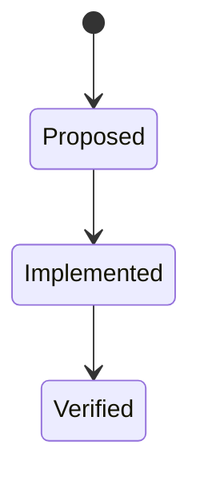

Use this skill when creating, editing, or reviewing Mermaid diagrams in any markdown file.

## Why diagrams matter

Diagrams help readers — and *you* — make better decisions by visualizing relationships that prose alone struggles to convey. If you're writing prose and catch yourself saying *"then if X, we go to Y, unless Z, in which case…"* — stop and draw a diagram.

## Where diagrams add the most value

Proactively suggest diagrams when the problem touches any of these areas:

| Category | Examples | Best diagram type |
|---|---|---|
| **State & lifecycle** | Boolean flags, mode toggles, requirement status, connection states, auth sessions | `stateDiagram-v2` |
| **UI/UX flows** | Screen navigation, wizard steps, modal sequences, onboarding funnels | `stateDiagram-v2` or `flowchart` |
| **Protocols & handshakes** | Request/response, OAuth flows, WebSocket lifecycle, API auth sequences | `sequenceDiagram` |
| **Call graphs & dependencies** | Function call chains, module imports, service dependencies | `flowchart TD` |
| **Data flow & pipelines** | ETL, event streams, message queues, data transformation chains | `flowchart LR` |
| **Decision logic** | Branching business rules, validation trees, feature flag routing | `flowchart TD` |
| **Entity relationships** | Data models, foreign keys, aggregation vs composition | `erDiagram` |
| **Infrastructure & deployment** | Service topology, container orchestration, cloud architecture | `flowchart` or `C4` |
| **Network topology** | LAN/WAN layout, firewall zones, load balancer routing, DNS resolution paths | `flowchart` |
| **Distributed systems** | Consensus protocols, leader election, partition handling, replication flows, High Availability flows, CAP trade-offs | `sequenceDiagram` or `stateDiagram-v2` |
| **Class hierarchies** | Inheritance, interfaces, mixins | `classDiagram` |
| **Async & concurrency** | Race conditions, locks, actor message flows, promise chains | `sequenceDiagram` |
| **Error & recovery flows** | Retry strategies, circuit breakers, fallback paths, rollback sequences | `stateDiagram-v2` |
| **User journeys** | End-to-end workflows, happy path vs edge cases, support escalation | `flowchart` or `journey` |
| **CI/CD & build pipelines** | Job dependencies, artifact flow, deploy gates | `flowchart LR` |
| **Permissions & RBAC** | Role hierarchies, permission inheritance, access control matrices | `flowchart TD` |
| **Game & turn logic** | Game loops, turn sequences, win/lose conditions | `stateDiagram-v2` |
| **Caching & invalidation** | Cache states, TTL transitions, write-through vs write-back | `stateDiagram-v2` |

> **ℹ️ Info:** State machines (`stateDiagram-v2`) are especially underused. Whenever something has "modes", "flags", or "phases", a state diagram makes implicit transitions explicit and catches impossible states early.

Put diagrams in the most applicable markdown file, directly next to the text they support.

## Inline Mermaid is the right default

Add diagrams as fenced `mermaid` code blocks directly in markdown:

~~~markdown

~~~

**Why inline, not external `.mmd` files?**
- Diagrams live *with* the docs they explain — single source of truth.
- VS Code, GitHub, and most modern viewers render them natively with no build step.
- No generated PNG/SVG assets to track in git (noise, merge conflicts, staleness risk).
- Portable — works anywhere that supports Mermaid.

Use `mmdc` purely as a **linter** to catch syntax errors before committing, not as a build tool that produces generated assets.

## Validation command

```bash
mmdc -i <path/to/file.md>
```

Run after every edit. All charts must show ✅ before the work is done. If mmdc is not
installed: `npm install -g @mermaid-js/mermaid-cli` (requires Node 18+).

## Syntax rules (learned from VS Code + mmdc compatibility)

### Multi-line labels — use `<br>`, never `\n`
Both the VS Code renderer and mmdc require `<br>` for line breaks inside node labels and
transition descriptions. Literal `\n` is not rendered.

```
✅  A --> B : First line<br>Second line
❌  A --> B : First line\nSecond line
```

### No double quotes inside node labels
Double quotes inside `[]`, `()`, `{}` node labels cause a parse error in flowcharts.
Use single quotes, backtick-style prose, or simply omit the quotes.

```
✅  K -- Yes --> L[awaitingScorecardAccept = true<br>CHOOSE then GO]
❌  K -- Yes --> L[awaitingScorecardAccept = true<br>"CHOOSE then GO"]
```

### No second colon inside stateDiagram-v2 transition labels
In `stateDiagram-v2`, the first `:` after a state name starts the transition label.
A second `:` in the label body is parsed as a state-description separator and raises a
`DESCR` parse error in the stricter VS Code renderer.

```
✅  A --> B : implicit — no back handler in rogue mode
❌  A --> B : (implicit: same back handler not shown)
```

This restriction applies only to `stateDiagram-v2`. Flowchart (`flowchart TD/LR`) edge
labels do not have this limitation.

### Arrow style in flowcharts
Use `-->` for normal edges and `-- label -->` or `-- label -->` for labelled edges.
Avoid mixing `->` (single dash) with `-->`.

### Note blocks in stateDiagram-v2
Notes must reference an existing state name and use the exact keyword form:

```
note right of StateName
    Free-form text here
end note
```

The `note right of` / `note left of` form is required — inline note shorthand is not
supported in `stateDiagram-v2`.

## Diagram types used in this repo

| Type | Keyword | Best for |
|---|---|---|
| State machine | `stateDiagram-v2` | Boolean flags, mode transitions, lifecycle states |
| Call graph / flow | `flowchart TD` or `flowchart LR` | Execution paths, call chains, save/restore flows |

## Workflow checklist

- [ ] `<br>` used for all label line breaks (no `\n`)
- [ ] No double quotes inside node label brackets
- [ ] No second `:` inside `stateDiagram-v2` transition labels
- [ ] `mmdc -i <file>` exits 0 with all charts showing ✅
- [ ] Diagrams render without errors in the VS Code Mermaid preview
